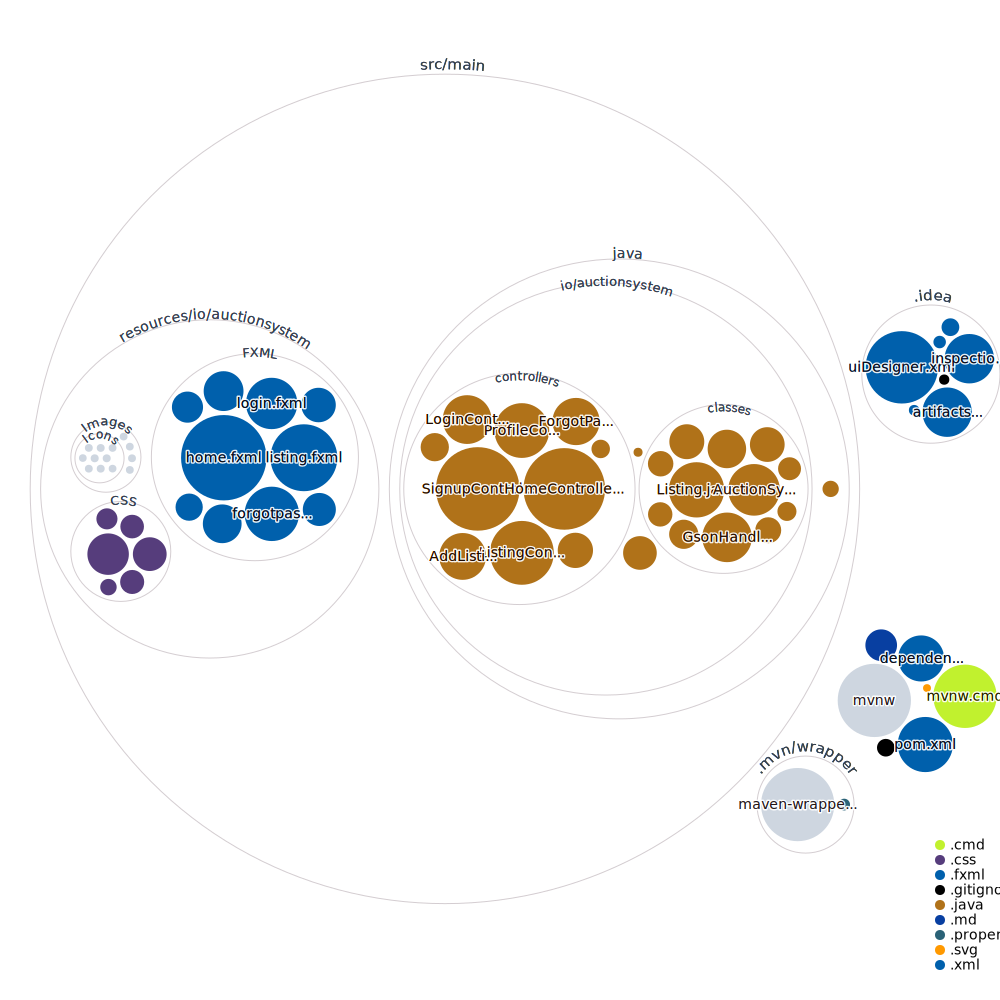

# Auction-System-JavaFX

### Intro:
Welcome to the Auction System! This is a JavaFX application that allows users to sell products for auction, place bids on those products, and can comment on any product.

### Contributors:
- Ahmed Abdullah
- Aqib Mughal

### About:
The Auction System is a simple auction application built with JavaFX. It allows users to list items for auction and bid on items. The system stores data and images of listings in Microsoft Azure and uses the Google Gson library to serialize and deserialize the data, which is stored in JSON format. The frontend of the application is designed using the Material FX library. In order to run the application, users will need to have Java 8 or above installed, as well as an Azure Storage account and the Google Gson and Material FX libraries. The application can be set up by cloning the repository, setting up the required libraries and dependencies, and running the main method in the Main.java file. The project is licensed under the MIT License.
### Dependencies:
- Material FX
- Google GSON

### Screenshots:

### Repo Visualisation:
